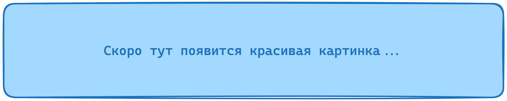

Курс состоит из 8 занятий, направлен на то, чтобы узнать не столько фундаментальные методы машинного обучения, сколько инструментарий, который позволяет быстрее тестировать ML гипотезы.

Практические задания на курсе проверяются на основе одного из выбранных кейсов:
1. Система анализа качества воздуха с датчиков
2. Приложение для ухода за растениями
3. SkillMatch - платформа умного подбора менторов и курсов